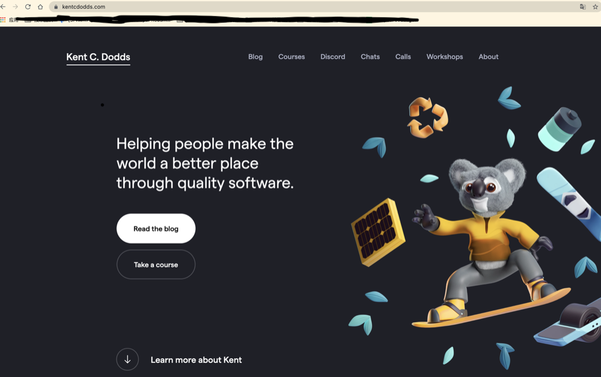

## web pages && websites && web server && search engines的区别

### web page 网页
网页，具有.html扩展的文件，可以在浏览中展示。网页之间可以相互链接，一个网页可以嵌入其他的资源，比如样式信息，脚本，媒体类型（音视频，图片等）。

> 这里要注意，浏览器也可以展示其它PDF文件或图像等，但是网页（web page）这个术语特指HTML文档，其他的只能叫做文档（document）。

所有的网页都可以通过一个唯一的地址来获取。通过在浏览中的地址栏输入网页的地址即可在浏览器中展示了。

上图中展示的就是一个网页的地址。

### website 网站
网站，由共享同一个域名的一组可链接的网页（加上它们的资源）集合组成。当我们在浏览器的地址栏输入一个域名之后展示的是这个域名对应网站的主页（home web page）。

一般一个网站会多个网页，如果一个网站仅包含一个网页，这类网站叫做“单页网站”（***single-page website***）

### Web Server (Web 服务器)
Web服务器是托管一个或多个网站的计算机。托管（Hosting）意味着该计算机上可以使用所有的网页及其支持文件。

也不要混淆了Web服务器和网站的概念。如果一个人说：“我的网站没有响应”，这表示服务器没有响应，因此这个网站不能使用。然而，由于一台计算机可以托管一个或多个网站，因此如果说“我的web服务器没有响应”，这表示在这台服务器上托管的多个网站都不可用。

### 搜索引擎(Search Engine)
搜索引擎是一个特殊的网站，用来帮助用户从其它网站找到相应的网页。
> 不要混淆了浏览器和搜索引擎的关系。

浏览器是一种用来获取和展示网页的 ***软件***。搜索引擎是网站。困惑的点在于当打开一个浏览器的时候，浏览器展示搜索引擎的主页。这其实没什么问题，因为打开浏览器的目的就是为了搜索和展示网页。
所以，浏览器是软件，搜索引擎是网站，其实就是Chrome和Google的关系。

### 参考文献

[MDN文档](https://developer.mozilla.org/en-US/docs/Learn/Common_questions/Pages_sites_servers_and_search_engines)