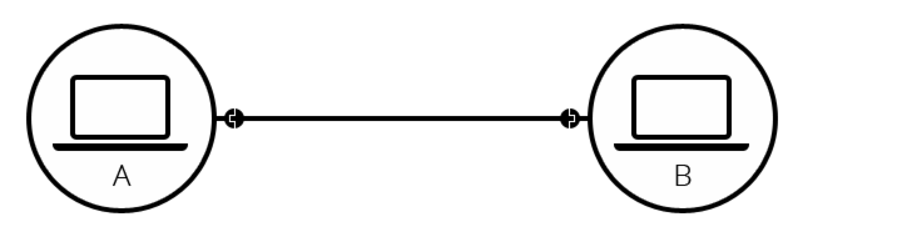

## 互联网

> **互联网使得万维网成为可能。互联网是由连接设备、路由器和调制解调器组成的全球系统。**

#### 互联网是如何运作的

1. 简单的连接

当两台计算机需要通信时，需要通过物理方式（通常是网线）或无限方式（蓝牙或 Wifi）进行连接。所有的现代计算机都支持这些连接方式。以物理方式为例：

两台计算机之间的连接需要一根网线，然而网络不限制计算机的数量，可以根据需要连接任意台计算机，这样的话，复杂度就高了起来。以 10 台计算机为例，它们如果要互相连接, 需要 45 根网线，每个计算机 9 个插头。

为了解决以上的问题，网络上的每台计算机可以连接到一个被称为 **_路由器_** 的微型计算机上。路由器的工作只有一个：确保从给定计算机发送的消息准确到达正确的目标计算机。要将消息发送到计算机 B，计算机 A 必须将消息发送到路由器上，路由器再转发给计算机 B，并确保不会将消息转发给计算机 C。

有了路由器之后，有着 10 台计算机的网络结构只需 10 根网线，每台计算机一个插头和一个有 10 个插头的路由器。如下图所示：

2. 网络中的网络

通过路由器可以让复杂的计算机网络变得相对简单，但是以上只是计算机数量较少的情况，如果有成百，上千，百万，十亿个计算机呢？毫无疑问一个路由器是无法扩展这么多的。**路由器也是一个计算机**，因此，可以让多个路由器之间进行连接。通过计算机连接到路由器，路由器连接到路由器，我们可以扩展到无限大。

以上的网络非常接近我们所说的互联网，但是还少了一些东西。从上面可以看出来，我们可以根据自己的需要建立一个网络，然而，世界上任何人都可以拥有自己的计算机网络。但是不可能从每个人的屋子里和世界上其他任何地方架设电缆。怎么处理？ 现在已经有电缆连接到每个人的房子了，比如：电线和电话线。电话基础设施可以将世界上的任何人连接起来，因此电话线是满足需要的完美电线。若要将我们的网络连接到电话基础设施上，需要一个名为**调制解调器**的设备，它可以将网络的信息转换为电话基础设施可以管理的信息，反之亦然。

> 调制解调器， 俗称猫儿，是计算机和电话线之间进行信号转换的装置，由调制器和解调器两部分组成。调制器用于将计算机的数字信号调制成模拟信号在电话线上传输。在接收端，解调器再把模拟信号转换为计算机能接收的数字信号。通过调制解调器和电话线就可以实现计算机之间的数据通信。

为了将信息从我们的网络传达到我们想要去的网络，我们需要把我们的网络连接到网络服务供应商（ISP）。ISP 是一个管理着一些特殊路由器的公司，这些路由器都连接在一起，也可以访问其它 ISP 的路由器。因此，来自我们的网络的信息通过 ISP 网络到达目标网络。**互联网由整个网络的基础设施组成。**

3. 查找电脑

如果想要把信息发送到一台计算机上，你需要辨别是哪一台计算机。因此，任何连接到网络的计算机都有一个唯一的地址来标识它，称为IP地址（其中IP代表 Internet 协议）。它是由一系列由点分割的四个数字组成，如192.168.2.10 

> 注： 以上为IPv4地址格式，先有些网站已支持IPv6格式。

但是，对于人类来说，IP地址的数值太难记住了。为方便起见，我们可以使用一个人类可读的名称（称作： 域名）来标识IP地址。比如，域名google.com表示的IP地址为142.250.190.78

4. Internet和Web

上面内容中描述的均是互联网。互联网是技术上的基础设置，它允许数十亿台计算机连接在一起。在这些计算机中，一些计算机（称为Web Server），可以向Web浏览器发送可理解的消息。互联网是一种基础设置，而Web是一种建立在基础设施之上的服务。还有其它的类似的建立在Internet上的服务，如电子邮件和IRC等。

5. 