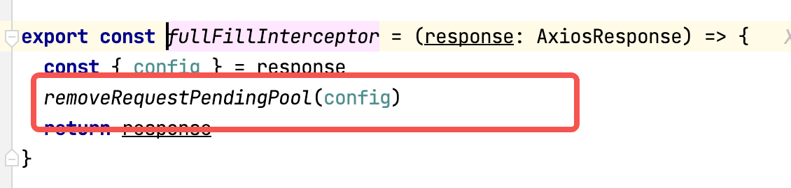

### 实现请求池的思路
请求池的作用主要是为了关掉一些不必要的请求来节省服务器资源。

首先，需要明确，请求池的操作可以有哪些，具体的使用场景主要在哪里。

#### 操作
- 添加请求
  - 当发送一个新请求的时候，就在请求池中添加一个
- 移除某一个请求
  - 当请求有结果之后，移除该请求
- 移除所有请求
  - 当用户没有应用权限的时候，取消当前所有请求，并跳转到登陆页面

#### 具体实现
1. 可以使用map来管理请求池中的请求，通过一些数据生成每个请求对应的唯一key

2. 由于请求池涉及到每个请求，因此操作最佳添加位置为请求拦截器。通过添加相应的拦截器来执行不同的请求池操作。



3. 增删操作
> 注意，在往请求池中添加新请求的时候，要注意取消已存在的请求，当遇到多个连续的同一个接口请求时，最后一个才是必要的。
- 添加
```javascript
const addRequestPendingPool = (config: AxiosRequestConfig) => {
  removeRequestPendingPool(config)
  const key = generateUniqueKey(config)
    // 这里要添加一个新的AbortController, 并把请求配置config的signal设置为新建的controller.signal
    // 这样的话就可以在取消请求的时候直接调用abort进行取消
  const controller = new AbortController()
  config.signal = controller.signal
  if (!pendingPollMap.has(key)) {
      // 要进行bind, 函数中this的执行问题一样的原因
    pendingPollMap.set(key, controller.abort.bind(controller))
  }
}
```
- 单一删除
```javascript
const removeRequestPendingPool = (config: AxiosRequestConfig) => {
  const key = generateUniqueKey(config)
  if (pendingPollMap.has(key)) {
    const cancel = pendingPollMap.get(key)
    cancel?.()
    pendingPollMap.delete(key)
  }
}
```
- 删除所有
```javascript
const clearRequestPendingPool = () => {
  pendingPollMap.forEach((cancel) => {
    cancel?.()
  })
  pendingPollMap.clear()
}
```