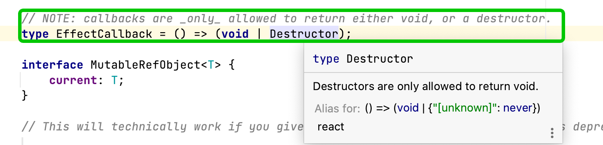

## 在useEffect中执行异步请求的几种方式

当在React中使用异步请求时，通常使用useEffect来触发异步请求的执行，以便在组件挂载时或某些特定状态发生变化时获取数据。


在使用useEffect时，我们可以采用多种方式来执行异步请求，其中包括使用异步函数表达式、IIFE、Promise.then和函数声明。但是，需要注意的是不能将async函数直接传递给useEffect，
如果直接把async函数传给useEffect最为第一个参数，会报错。因为useEffect的第一个参数的最终返回值要是void。而async函数是返回一个Promise。



### 当在useEffect中执行异步请求时，可以使用以下几种方式：
- 使用异步函数表达式
```javascript
useEffect(() => {
     const fetchData = async () => {
        const result = await axios(
            'https://hn.algolia.com/api/v1/search?query=redux',
        );
        setData(result.data);
    }
    fetchData();
}, []);
```
可以将函数表达式放在外面的useCallback函数中，以便在其他地方使用该函数。

```javascript
const fetchData = useCallback(async () => {
    const result = await axios(
        'https://hn.algolia.com/api/v1/search?query=redux',
    );
    setData(result.data);
}, []);

useCallback(() => {
    fetchData();
}, [fetchData]);
```

- 使用IIFE
```javascript
useEffect(() => {
    (async () => {
        const result = await axios(
            'https://hn.algolia.com/api/v1/search?query=redux',
        );
        setData(result.data);
    })();
}, []);
```
这种方式使用立即调用函数表达式来执行异步请求。


- 使用Promise.then

```javascript
useEffect(() => {
    axios(
        'https://hn.algolia.com/api/v1/search?query=redux',
    ).then(result => setData(result.data));
}, []);
```
这种方式使用then方法来处理异步请求的响应结果。


- 使用函数声明
```javascript
useEffect(() => {
    async function fetchData() {
        const result = await axios(
            'https://hn.algolia.com/api/v1/search?query=redux',
        );
        setData(result.data);
    }
    fetchData();
}, []);
```


